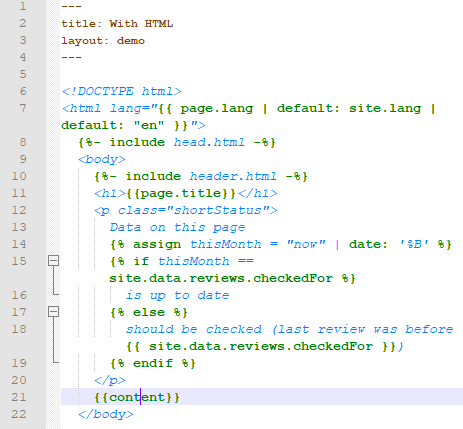
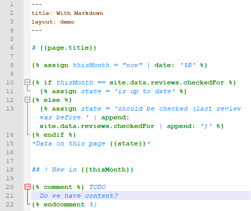

---

STATUS: a first "PoC", esp. coverage of keywords rather 1 as 2%

---

[//]: # (* TOC{:toc})
<a href="#tldr">TL;DR</a>
<a href="#installation">Installation</a>
<a href="#purpose">Purpose</a>
<a href="#principal-limitations">Principal Limitations</a>
<a href="#shortcomings-by-implementation">Shortcomings by Implementation</a>
<a href="#alternatives-at-hand">Alternatives at hand</a>
<a href="#legal">Legal</a>

# jekyll-LARD for Notepad++

*Fold and highlight Jekyll / Liquid constructs in Notepad++, emphasis on "fold"*

## TL;DR

Not *HTML / Markdown **and** Jekyll / Liquid*, but at least *HTML / Markdown **or** Jekyll / Liquid*, i.e. code fold / highlight the Jekyll / Liquid parts of a file instead of / alternative to HTML / Markdown parts.

## Installation

1. Download / save [jekyll-lard.udl.xml](https://raw.githubusercontent.com/larspourlard/jekyll-lard-notepad-plus-plus/master/jekyll-lard.udl.xml) (can be deleted later; all other files here are just for documenation / testing)
2. Find your way to Notepad++' "Language" menu and there something like "user defined", depends on Notepad++ version and translation, **OR** try to find this little image in the midth of the toolbar:  (and click it, of course)
3. Hopefully arrived at the "User Defined (Language)" dialog, click "Import ..."
4. Choose "jekyll-lard.udl.xml", maybe displayed only as "jekyll-lard.udl"
5. After "Import succesful", restart Notepad++
6. In case you are very rigid in separating files for HTML / Markdown content and Jekyll / Liquid logic, you may save the latter with an "*.jek" extension so that Notepad++ directly associates jekyll-LARD, otherwise choose it per file in the "Language" menu (Notepad++ will then try to remember that *per file*)

## Purpose

If you want to manage anything text-like with rich functionality in a nutshell, there's no way around [Notepad++](https://notepad-plus-plus.org/), it's even worth buying Windows machines solely for editing with it, otherwise get it via [Wine](https://www.winehq.org/).

If you want to compose anything text-like from building blocks with rich functionality in a nutshell, there's no way around [Jekyll](https://jekyllrb.com/).

Unfortunately there's no native higlighting or code folding in Notepad++ or any other known editor / IDE for the [Liquid templating language](https://github.com/Shopify/liquid/wiki/Liquid-for-Designers) used by Jekyll (with [additions](https://jekyllrb.com/docs/liquid/)). **This gap is to be filled with the so called ["User Defined Language" (UDL)](https://ivan-radic.github.io/udl-documentation/) right here.**

> For (existing) highlighters / code folders for the Jekyll supported data types Markdown, YAML, JSON, CSV, TSV, and of course HTML see elsewhere.

## Principal Limitations

It is not possible to *extend* Notepad++' built-in HTML highlighting / codefolding with UDLs due to technical reasons (cf. [Stack Overflow](https://stackoverflow.com/questions/8575865)), and it is obviously not possible to *replace* built-in highlighting / code-folding by UDLs since UDLs simply have no option to define HTML tag structures (you may be able to encolor "tags" as keywords but will lose general functionalities with HTML files).

## Shortcomings by Implementation

Foldable section markers like "if", "for", "comment" etc. will produce also and then totally wrong folding when used literally in text (see [Principal Limitations](#prinicipal-limitations): no real structure with UDLs). As you are here because you want to build from blocks, you may separate text (content) from build information (Jekyll / Liquid instructions) to work around this trap. Or write `&nbsp;for` in literal contexts instead of ` for` (`For` with big `F` at the beginning of sentences etc. poses no problem). Or don't write too often about things that are "for" and then only "if". And of course you may run into strange scenarios if your Liquid template is rather complex (but that could be also a useful *general* hint, of course).

## Alternatives at hand

Depending on your coding style and your needs you may mis-use Notepad++' built-in support for Python or Visual Basic ("vb" or "vbs" file extensions). Both can code fold HTML / Markdown *with* Liquid, but folds could be too far as well as too short since both are not based on pairs of start and end markers, but on block indent. If you can live with that, you may extend the Keywords for Python or Visual Basic with HTML and Liquid ones in `langs.model.xml` sections for `Language name="python"` or  `Language name="vb"`, google for details on that.

## Legal

Copyright (C) 2019  Lars Pourlard

This program is free software: you can redistribute it and/or modify it under the terms of the GNU General Public License as published by the Free Software Foundation, either version 3 of the License, or (at your option) any later version.

This program is distributed in the hope that it will be useful, but WITHOUT ANY WARRANTY; without even the implied warranty of MERCHANTABILITY or FITNESS FOR A PARTICULAR PURPOSE.  See the GNU General Public License for more details.

You should have received a copy of the GNU General Public License along with this program (file LICENSE).  If not, see https://www.gnu.org/licenses/.
